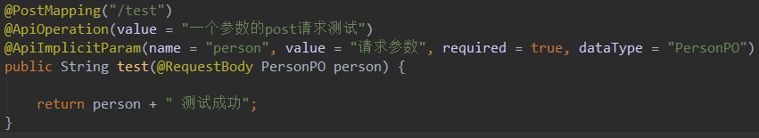
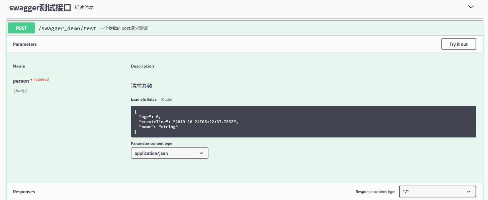
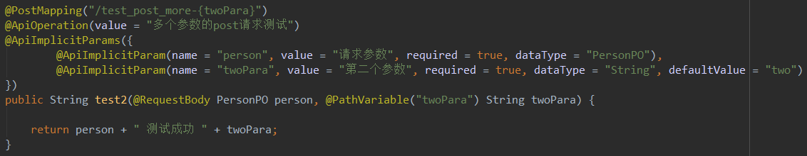
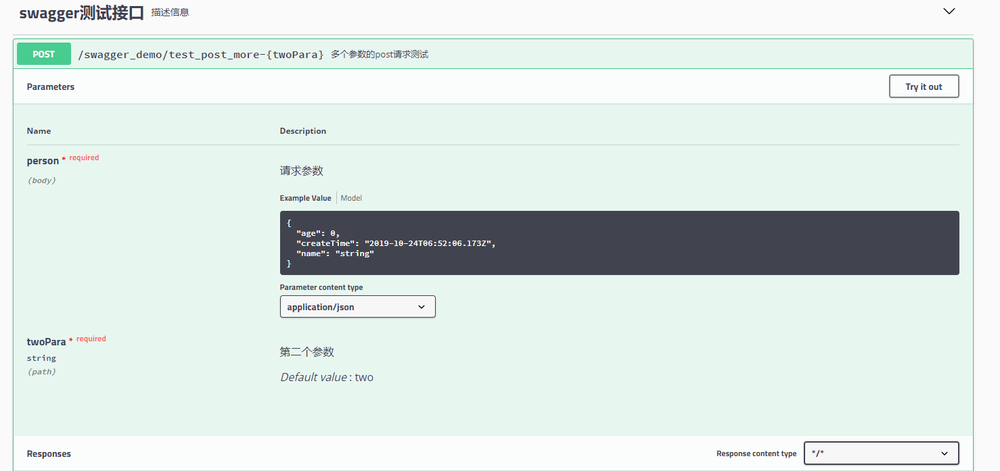
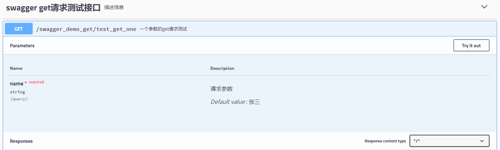
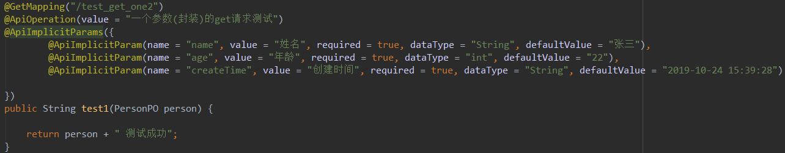
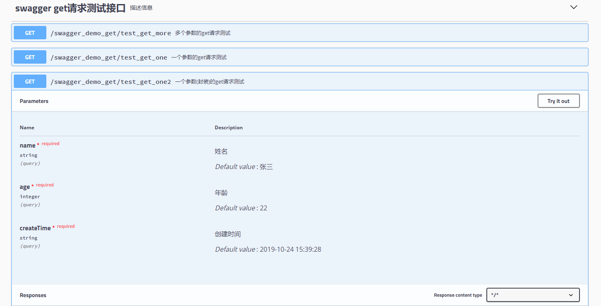
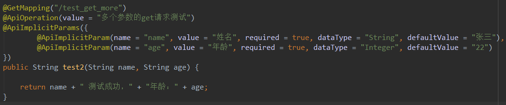
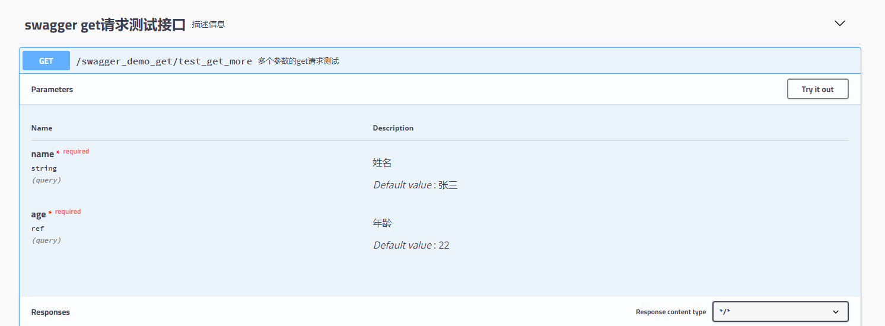
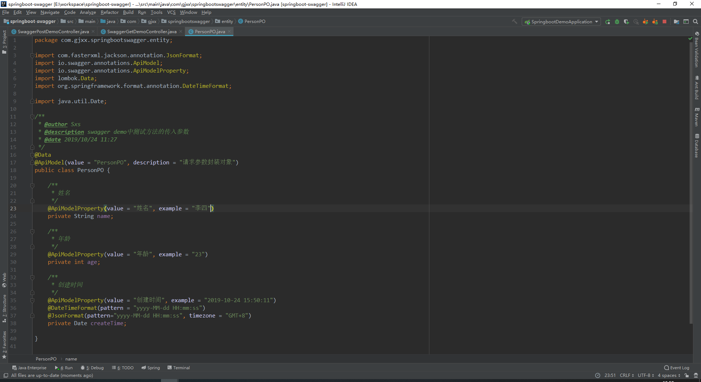

# springboot-swagger
springboot+swagger2 demo


## swagger使用
### 1. pom引入swagger依赖
```
<properties>        
    <swagger.version>2.8.0</swagger.version>
</properties>

...

<!-- swagger2配置 -->
<dependency>     
    <groupId>io.springfox</groupId>     
    <artifactId>springfox-swagger2</artifactId>     
    <version>${swagger.version}</version>
</dependency>
<dependency>     
    <groupId>io.springfox</groupId>
    <artifactId>springfox-swagger-ui</artifactId>
    <version>${swagger.version}</version>
</dependency>
```

* * *

### 2. 配置文件
```
[application.yml]

spring: 
    profiles:   
        active: dev
    
server:  
    port: 8088  
    servlet:    
        context-path: /nacservice

---

spring:  
   profiles: dev

---

spring: 
    profiles: prod
```
or
```
[application.properties]
spring.profiles.active=dev
server.port=8088s
erver.servlet.context-path=/nacservice

[application-dev.properties]

[application-prod.properties]
```

* * *

### 3. 新建swagger配置类

此外，为了安全起见，应该在类上加上注解：`@Profile({"dev"})`
此注解，会使此配置类，只有在dev环境下才能起作用。

* * *

### 4. controller加注解
在类上添加：
`@Api(tags = "swagger测试接口", description = "描述信息")`


#### 4.1 一个参数的post请求
在方法上添加：
`@ApiOperation(value = "一个参数的post请求测试")`
`@ApiImplicitParam(name = "person", value = "请求参数", required 
= true, dataType = "PersonPO")`




#### 4.2 多个参数的post请求
在方法上添加：
```
@ApiOperation(value = "多个参数的post请求测试")
@ApiImplicitParams({ 
    @ApiImplicitParam(name = "person", value = "请求参数", required = true, dataType = "PersonPO"), 
    @ApiImplicitParam(name = "twoPara", value = "第二个参数", required = true, dataType = "String", defaultValue = "two")
})
```




#### 4.3 一个参数的get请求
##### 4.3.1 普通参数
在方法上添加：
`@ApiOperation(value = "一个参数的get请求测试")`
`@ApiImplicitParam(name = "name", value = "请求参数", required = 
true, dataType = "String", defaultValue = "张三")`




##### 4.3.2 封装参数
在方法上添加：
```
@ApiOperation(value = "一个参数(封装)的get请求测试")
@ApiImplicitParams({
    @ApiImplicitParam(name = "name", value = "姓名", required = true, dataType = "String", defaultValue = "张三"),        
    @ApiImplicitParam(name = "age", value = "年龄", required = true, dataType = "int", defaultValue = "22"),        
    @ApiImplicitParam(name = "createTime", value = "创建时间", required = true, dataType = "String", defaultValue = "2019-10-24 15:39:28")
})
```





#### 4.4 多个参数的get请求
在方法上添加：
```
@ApiOperation(value = "多个参数的get请求测试")
@ApiImplicitParams({
    @ApiImplicitParam(name = "name", value = "姓名", required = true, dataType = "String", defaultValue = "张三"),
    @ApiImplicitParam(name = "age", value = "年龄", required = true, dataType = "Integer", defaultValue = "22")
})
```




* * *

### 5. 实体加注解




* * *

### 6. 启动项目
加启动参数：
开发环境：--spring.profiles.active=dev
生产环境：--spring.profiles.active=pord

